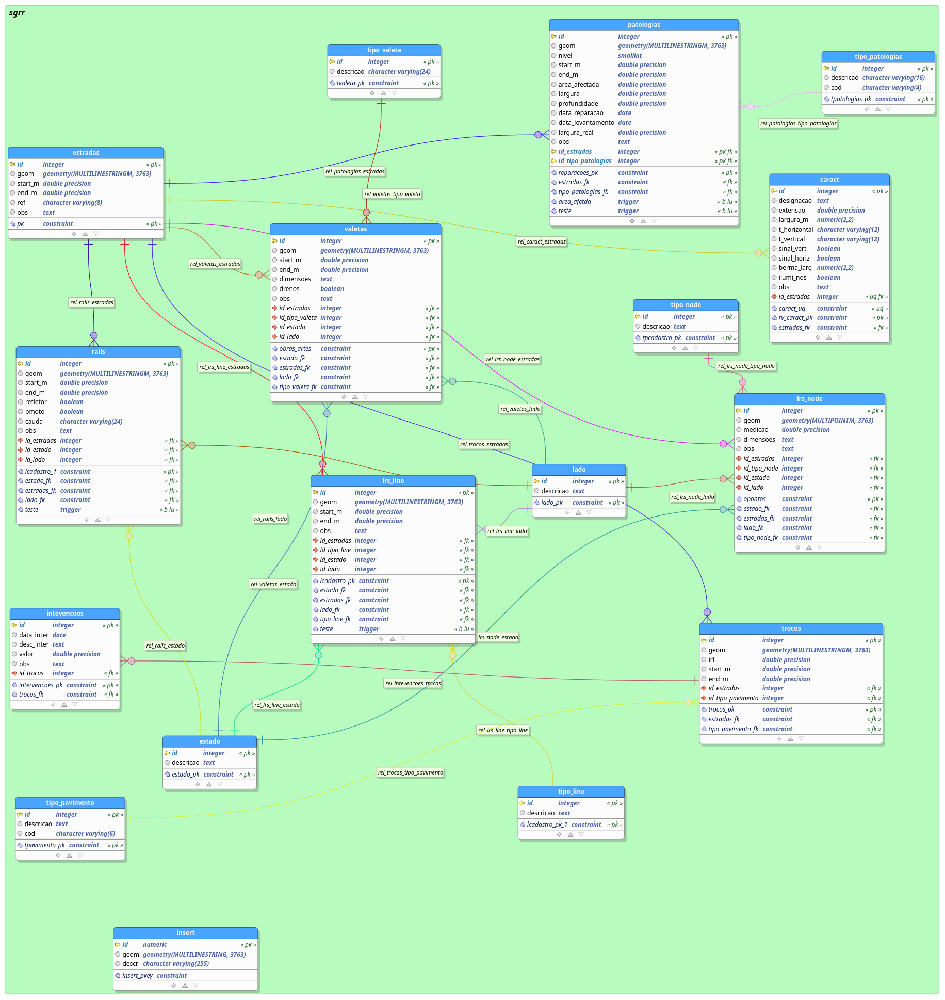

 
# Modelos de Dados para gestão de redes rodoviárias

SGRR - Sistema de Gestão de Rede Rodoviária *(é óbvio que o nome pode mudar)*

* é baseado neste [trabalho](http://osgeopt.pt/sasig2015/files/15_Pedro_Sim%C3%B5es_Hugo_Santos_SASIG2015.pdf) e [apresentação](http://osgeopt.pt/sasig2015/files/keynotes/hugo/sgrr.html#/step-7)
* A ideia é a aplicação de um [Linear Reference System (LRS)](https://en.wikipedia.org/wiki/Linear_referencing) na BD para uso em **n** tipo de *software*, SIG ou não
* inclui um dump com informação exemplificativa, para testes (informação não sensível e desatualizada)
* adicionado um diagrama da BD em formato pgmodeler

**exemplo do funcionamento em QGIS**

### NOTAS

* deverá ser considerada com uma versão alpha V01, como prova de conceito
* não se encontra devidamente documentada

 
 
